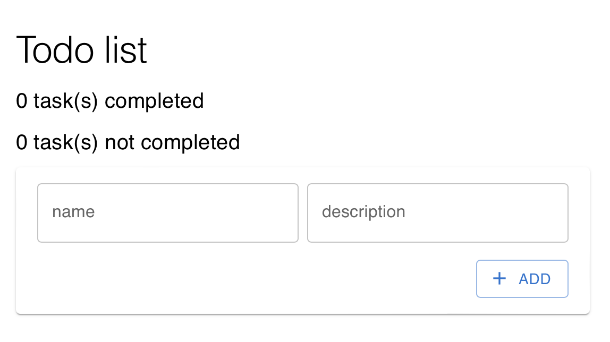
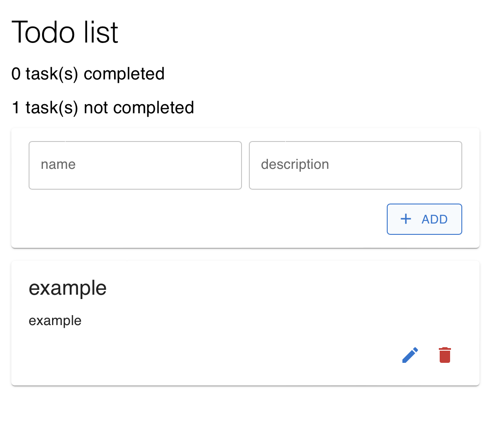
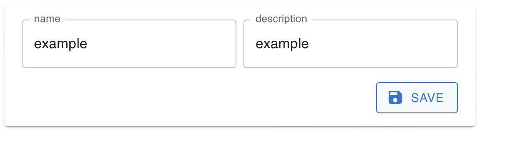
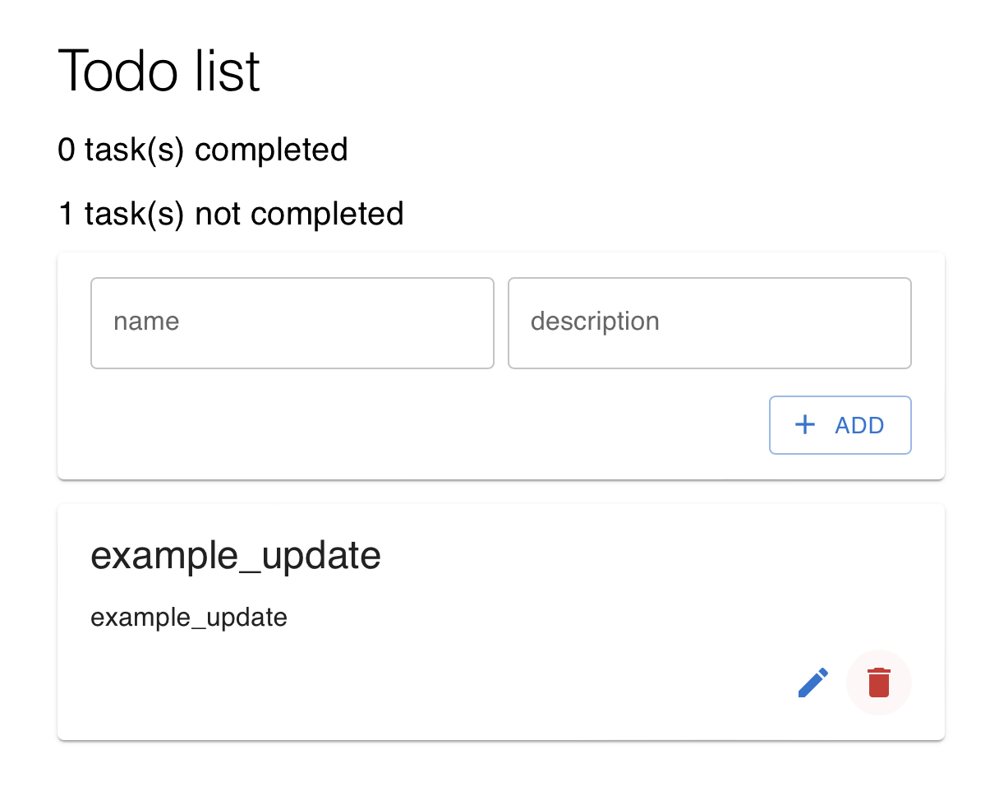
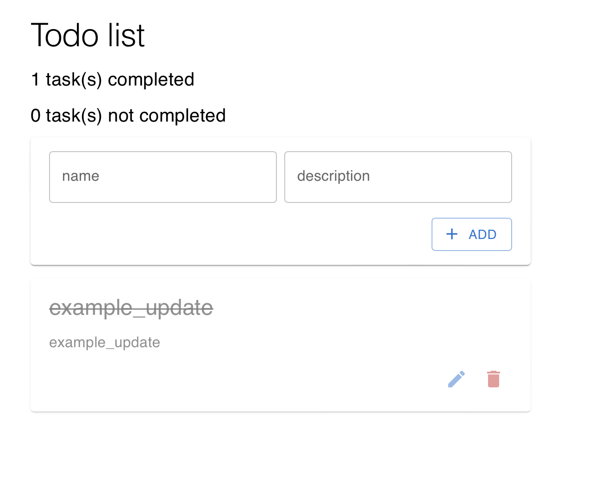

# TodoList с использованием Redux Toolkit

## Функционал

### Добавление
Добавление происходит при заполнении в форме минимум названия задачи и нажатии на кнопку "ADD".
При этом увеличивается количество невыполненных задач.

### Редактирование
После добавления задачи ее можно отредактировать путем нажатия на кнопку "редактировать".
После нажатия на эту кнопку откроется окно редактирования, в котором можно изменить название и описание и сохранить изменения.

### Изменение статуса задачи на "выполнена"
Можно нажать на название задачи, после чего ее статус измениться на "выполнена" и она окраситься в серый цвет. В свою очередь количество выполненных и не выполненных задач измениться. При повторном нажатии задача снова считается не выполненной,

### Удаление
При нажатии на кнопку удаления задача удалиться из списка задач.